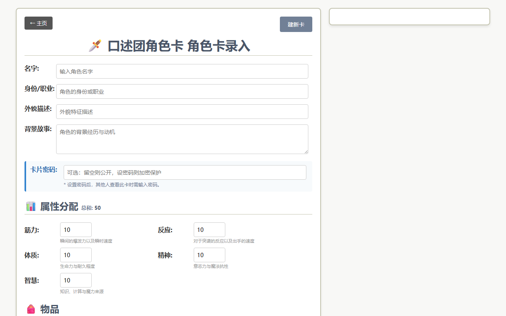
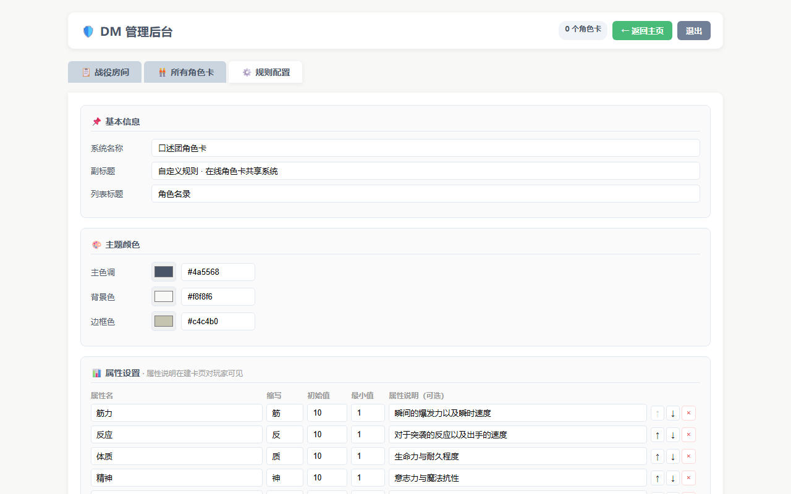

# 口述团角色卡系统

[English](README.md) | [中文](README.zh.md)

**专为口述团和自制规则设计的在线角色卡共享系统**

DM 在后台配置规则，玩家手机打开链接填卡——不需要安装任何软件，不需要传 Excel 文件。

---

## 为什么做这个

口述团和小规则跑团通常没有专属工具支持。玩家要么手写卡，要么用 Excel 本地存储。出门在外无法查看角色卡，DM 也难以统一管理所有玩家的角色信息。

这个系统解决的核心问题：
- 玩家离家时用手机查看自己的角色卡
- DM 在一个页面看到所有玩家的角色状态
- 任何自制规则都可以在后台配置，无需改代码

---

## 功能

| 功能 | 说明 |
|---|---|
| **后台规则配置** | 设置属性名称、初始值、说明文字，开关显示模块，调整主题颜色 |
| **战役房间系统** | DM 创建房间，复制邀请链接发给玩家，角色卡按战役归档 |
| **角色卡共享** | 所有数据存在服务器，URL 即档案，手机直接访问 |
| **密码保护** | 每张角色卡可设密码，保护隐私信息；DM 后台始终可见全部角色 |
| **DM 总览** | 后台查看所有玩家角色卡，包含属性、战役管理和规则配置 |

### 角色卡录入页


### DM 管理后台 — 规则配置


---

## 技术栈

- **后端：** Python 3.11 / Flask，SQLite
- **前端：** 原生 HTML / CSS / JavaScript（无框架依赖）
- **部署：** Docker + gunicorn；含 `railway.toml` 和 `render.yaml` 支持一键云部署

---

## 本地运行

```bash
# Python 直接运行
pip install -r requirements.txt
python app.py
# → http://localhost:5000

# 或 Docker
docker-compose up -d
```

默认 DM 密码：`dm123456`，部署前请在 `config.json` 中修改。

---

## 云部署

数据库文件在 `data/characters.db`，支持 Docker 持久化卷的平台均可部署。

**推荐平台：** Railway、Render、Fly.io / 阿里云、腾讯云、华为云

```bash
# 通用 VPS 流程
git clone https://github.com/ZhenWei-Shi/trpg-card-hub
cd trpg-card-hub
cp .env.example .env        # 修改 SECRET_KEY
docker compose up -d
# 在防火墙/安全组放行 5000 端口
```

Railway / Render 用户：导入仓库后可自动部署，**注意将持久化存储挂载至 `/app/data`**，否则重启后数据丢失。

---

## 使用流程

```
1. DM 登录 /admin（默认密码：dm123456）
   └── 规则配置 Tab → 设置属性、字段名、显示模块

2. DM 创建战役房间
   └── 战役房间 Tab → 新建 → 复制邀请链接发给玩家

3. 玩家打开链接
   └── 按 DM 配好的规则填写角色卡，可设置密码保护

4. 随时随地查看
   └── 手机打开房间链接 → 输入密码 → 查看 / 编辑角色卡
```

---

## 配置说明

所有规则配置通过 **DM 后台 → 规则配置** 完成，无需编辑任何文件：

| 配置项 | 说明 |
|---|---|
| 属性列表 | 自定义属性名、缩写、初始值、最小值、说明文字 |
| 字段名称 | 修改"职业/外貌/背景"等字段的显示名和提示文字 |
| 显示模块 | 开关特性区、技能区、物品区 |
| 主题颜色 | 主色调、背景色、边框色 |

修改后玩家刷新页面即时生效，现有角色卡数据不受影响。

---

## 修改默认 DM 密码

部署后请修改 `config.json` 中的密码：

```json
{
  "admin": {
    "password": "你的新密码"
  }
}
```

---

## License

MIT — 随意 fork 部署成自己的版本
